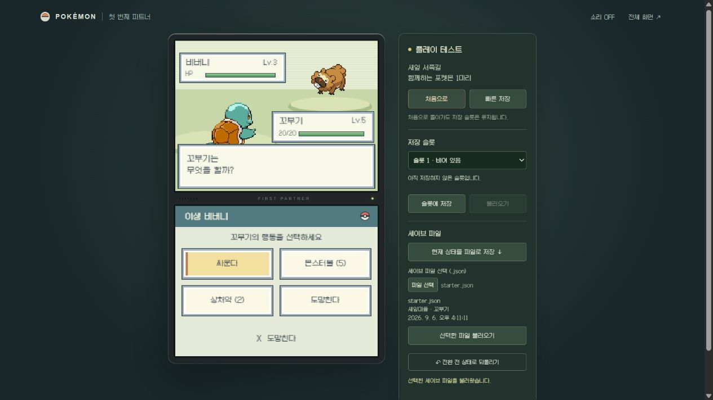

# Pokémon Nexus

> A browser-based Pokémon fan RPG inspired by the dual-screen presentation and lively world design of Nintendo DS-era Black, White, Black 2, and White 2.

Pokémon Nexus is a work-in-progress TypeScript game focused on making preparation, exploration, catching and raising Pokémon, city activities, Gym challenges, and the next journey feel like one connected adventure.

포켓몬 넥서스는 Nintendo DS BW·BW2 시대의 이중 화면 구성과 살아 있는 도시·도로 경험을 목표로 개발 중인 TypeScript 기반 팬게임입니다. 준비 → 탐험 → 포획·육성 → 도시 활동 → 체육관 → 다음 여행이 자연스럽게 이어지는 플레이를 만듭니다.



## Features / 주요 특징

- Explore connected routes, cities, forests, caves, and multi-floor facilities across regional travel segments.
- Encounter and catch wild Pokémon, build a party, use the Box and Pokédex, level up, evolve, and replace moves.
- Battle with type matchups, move PP, physical and special attacks, speed and priority, status conditions, items, switching, and capture decisions.
- Follow city-centered story slices that connect local residents, Pokémon ecology, activities, Gym preparation, and onward travel.
- Play through a browser interface built around a Nintendo DS-inspired field screen, lower-screen controls, dialogue, maps, and battle presentation.

- 여러 지방의 도로·도시·숲·동굴·다층 시설을 연결된 여행 구간으로 탐험합니다.
- 야생 포켓몬 조우와 포획, 파티·박스·도감, 레벨업·진화·기술 교체를 지원합니다.
- 타입 상성, PP, 물리·특수, 속도·우선도, 상태이상, 아이템, 교체와 포획 판단을 전투에 연결합니다.
- 주민·포켓몬 생태·도시 활동·체육관 준비·다음 목적지를 하나의 도시 중심 이야기로 구성합니다.

> This is an unofficial, non-commercial fan project. Pokémon and related trademarks belong to their respective owners.

## 실행

```powershell
npm.cmd install
npm.cmd run dev
```

자세한 조작과 진행 방식은 [플레이 안내](docs/GAMEPLAY.md)를 참고하세요.

## Development status / 개발 현황

The project is under active development. Implemented runtime behavior, planned content, and direct-play verification are tracked separately so roadmap items are not presented as completed features.

현재 그래픽은 BW·BW2풍으로 단계적으로 전환 중이며, 목표 디자인이 모든 지역에 적용되었다는 뜻은 아닙니다. 구현된 런타임, 설계 중인 콘텐츠, 직접 플레이 검증은 구분하여 기록합니다.

- [Current runtime data coverage / 현재 데이터 지원 범위](docs/WORLD_DATA_STANDARDS.md)
- [Current development handoff / 현재 개발 인계](docs/CONTINUE_STATE.md)
- [BW·BW2 visual direction / BW·BW2풍 시각 기준](docs/VISUAL_STYLE_BW_BW2.md)
- [Map size standards and ledger / 맵 크기 기준·전체 대장](docs/MAP_SIZE_STANDARDS.md)

## 문서

- [플레이 안내](docs/GAMEPLAY.md)
- [개발 기준](docs/DEVELOPMENT.md) · [스토리 기준](docs/STORY.md)
- [전체 지도](docs/WORLD_TOUR.md)
- [맵·스토리 개발 설계](docs/MAP_STORY_DESIGN.md) · [웹 참고 자료와 조사 근거](docs/REFERENCE_RESEARCH.md)
- [설계 데이터베이스](docs/개발용_데이터베이스_안내.md)
- [작업 규칙](docs/AGENTS.md) · [자동 운영](docs/AUTONOMOUS_WORKFLOW.md) · [배정 상태](docs/PROJECT_STATE.md)
- [문서 책임·충돌 해결과 전체 목록](docs/README.md)

## 검증

QA는 도시의 계획된 구현을 모두 끝낸 뒤 아래 검사와 도시 플레이를 모아서 수행합니다. 변경마다 반복하지 않습니다. [도시 완료 기준](docs/DEVELOPMENT.md#0-최우선-목표와-지방도시-작업-단위)과 [QA 규칙](docs/AGENTS.md#검증과-도시-완료)을 따릅니다.

```powershell
npm.cmd test
npm.cmd run build
```
