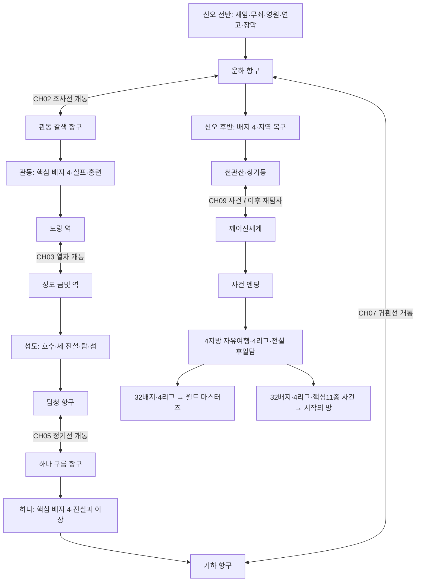

# 개발용 초안 맵 — 네 지방을 잇는 여행

> 문서 지위: 장기 초안/검토 이력이며 아래 역할 제한·작업 순서·개통 조건을 현행 구현 지침으로 상속하지 않는다. 확정 이야기만 STORY로 승격하고 [개발 기준 제0절](DEVELOPMENT.md#0-최우선-목표와-지방도시-작업-단위)의 지방→도시 단위 맵·스토리 구현에 적용한다. [도시 QA](AGENTS.md#검증과-도시-완료)와 지방별 확정 구간 번호를 우선한다.


> **현재 판정:** 이 문서는 90개 권역과 장기 콘텐츠 배치 초안이다. 통합 이동망·주요 마을·일부 통로는 구현됐지만 설계 노드와 실행 `MapId`는 1:1이 아니며, 장별 잠금·던전 사건·32체육관은 대부분 미구현이다. 실제 반영 범위는 [DEVELOPMENT 85절](DEVELOPMENT.md#85-설계-문서-반영-현황)을 우선한다.

작성일: 2026-09-06 · 현황 정리: 2026-09-07 · 초안 v0.1 · **논리 월드맵과 콘텐츠 배치안, 런타임 부분 반영**

연결 문서: [개발용 초안 스토리](개발용_초안스토리.md) · [현재 개발 기준](DEVELOPMENT.md) · [현재 스토리 기준](STORY.md)

후속 상세 설계: [개발용 데이터베이스 안내](개발용_데이터베이스_안내.md) · [지역별 출현표](개발용_지역별출현표.md) · [체육관 DB](개발용_체육관데이터베이스.md). 아래 123종 표는 최초 요청 목록을 보존하는 대조표이며 전체 도감은 후속 DB에서 확장한다. 세부 조우·진화·보상 수치는 DB를 우선하고 90권역·32체육관의 ID와 큰 동선은 유지한다.

## 1. 읽는 법과 설계 경계

2026-09-09 보완: 현재 장소·도시 연결·지방 교통은 [WORLD_ROUTES.md](WORLD_ROUTES.md), 공통 데이터 관계는 [WORLD_DATA_STANDARDS.md](WORLD_DATA_STANDARDS.md)를 먼저 확인한다. 아래 90노드 표는 생성기 입력이므로 열·ID를 보존한다. 신오·관동·하나의 프로젝트 표시 번호와 성도의 번호·동굴명은 각 지방 기준 문서가 관리한다.

초안 작성 당시 게임은 새잎마을과 실내를 포함한 6개 맵이었다. 현재는 391개 실사용 맵의 통합 이동망으로 확장됐지만, 이 문서의 90권역·콘텐츠 진행이 전부 구현됐다는 뜻은 아니다. 이 문서는 원작 지도 전체의 타일 단위 복제가 아니라 대표 도시·도로·던전을 이어 구성하는 **장기 설계도**다.

- S = 신오, K = 관동, J = 성도, U = 하나, X = 공통 후일담·특별 탐사.
- S01~U20과 X01~X10은 **권역/콘텐츠 노드 ID**다. 실행 중인 `MapId`가 아니며 실제 맵 파일 90개를 뜻하지 않는다.
- 한 도시는 외부 필드, 체육관, 포켓몬센터, 집 등 여러 실제 맵으로 분할한다. 복합 권역도 서로 떨어진 실제 장소별로 분할한다.
- `↔`는 양방향 길이다. 표의 해금 조건을 만족하면 양쪽에서 사용할 수 있다. `→`는 이야기의 권장 진행 순서로, 일방통행 워프라는 뜻이 아니다.
- 이 초안은 원작 도로 전체 번호를 확정하지 않는다. 다만 **성도 작업은 [성도 구현·맵 확장 기준 5절](JOHTO_REGION_GUIDE.md#5-도시-간-이동-구간-명세)의 도로/수로 번호·동굴 명칭·경유 순서를 우선 적용**한다. 다른 지방은 해당 지방 기준 문서를 따르고, 실제 타일 거리·출입 좌표는 해당 구간 제작 때 명시한다.
- 창작 마을, 기존 장소의 확장, 원작 장소의 재배치를 구분한다. 창작 우회로와 국제 항로를 원작 공식 지리로 설명하지 않는다.
- 스토리 장 CH, 사이드퀘스트 SQ, 후일담 PG는 스토리 문서의 ID를 그대로 사용한다.

권역은 신오 20 + 관동 20 + 성도 20 + 하나 20 + 공통 특별 10 = **90개 설계 노드**다. 작은 40~50개 실제 타일 맵만으로 32체육관과 모든 도시 실내까지 완성할 수 있다고 산정하지 않는다. 첫 제작 범위는 S01 확장과 S02다.

## 2. 전체 여행 지도



한 지방에 처음 도착한 뒤에는 개통한 항로·철도로 이전 지방에 돌아갈 수 있다. CH09까지 이야기 진행에 따라 새 목적지가 늘어나며, 엔딩 후 모든 기본 노선이 열린다.

## 3. 지방 간 교통 계약

**아래 최초 해금·왕복권·엔딩 직항은 장기 제안이며 현재 통행 조건이 아니다.** 현재 일반 네 노선은 무료 출구 왕복이고, 운하–갈색 NPC 조사선만 `researchDelivered`를 확인한다. `ferryPass`는 소모 티켓이 아닌 이용 이력이다. 실제 출구·조작·귀환은 [현재 교통 명세](WORLD_ROUTES.md#7-지방-간-이동-수단과-현재-이용-방법)를 따른다.

| 노선 | 출발 ↔ 도착 | 최초 해금 | 되돌아오기 / 비용 |
| --- | --- | --- | --- |
| TR01 공동조사선 | S10 운하 ↔ K01 갈색 | CH01 종료 + CH02 승선 안내 | 첫 출발 때 왕복권 등록. 기본 이동 무료 |
| TR02 자기부상열차 | K09 노랑 ↔ J01 금빛 | CH03 종료 | 즉시 왕복 가능. 타 지역 배지·포켓몬 압수 없음 |
| TR03 서쪽 정기선 | J10 담청 ↔ U01 구름 | CH05 종료 | 즉시 왕복 가능. 폭풍 연출 중에도 항구의 귀환 접수는 유지 |
| TR04 북쪽 귀환선 | U08 기하 ↔ S10 운하 | CH07 종료 | 즉시 왕복 가능. 기하 체육관 배지는 불필요 |
| TR05 고원 육로 | K03 상록 ↔ K17 석영 ↔ J18 고원 연결길 | CH09 이후 | 엔딩 전 열차를 대체하는 몰래 진입 경로가 되지 않음 |
| TR06 추가 직항 | S10 운하 ↔ J10 담청, K01 갈색 ↔ U01 구름 | CH09 이후 | 재방문 횟수를 줄이는 무료 직항 |
| TR07 원정선 | 각 PG의 지정 항구 ↔ X02/X04/X05/X06/X07/X09 | 해당 PG 해금 | §8의 접수처·항구 사용. 승선 전 귀환 항구 기록, 탐사 중 철수 가능 |

항구와 역은 필드 위험 구역 밖에 둔다. 초행 노선은 출발·도착·필요 조건·돌아오는 방법을 NPC와 지도에 명시한다. 돈이 없어서 섬에 갇히는 상황을 만들지 않는다. 처음부터 전 지방 좌표를 아는 순간이동 메뉴는 제공하지 않고, 개통한 노선만 선택한다.

## 4. 신오지방 — 출발과 귀환

### 4.1 권역 목록

| ID | 장소 / 성격 | 처음 열리는 때 | 핵심 콘텐츠 / 인접점 |
| --- | --- | --- | --- |
| S01 | 새잎마을 / 현재 마을, 신오 편입 제안 | 현재 구현 | 집·연구소·이웃집·작은 집. 서쪽 S02 |
| S02 | 새잎 서쪽길 / 창작 첫 도로 | CH00 출발 완료 | 첫 풀밭·회복 안내·첫 트레이너. S01↔S03 |
| S03 | 축복시티 / 기존 도시 재구성 | CH01 | 여행 수첩·통신 연구·분기 허브. S02/S04/S05/S20 |
| S04 | 무쇠시티·탄갱 / 기존 권역 | CH01 | GS01, 화석과 광물 관측. S03 |
| S05 | 영원숲·숲의 양옥집 / 기존 권역 확장 | CH01 | 숲길·SQ13 로토무. S03↔S06 |
| S06 | 영원시티 / 기존 도시 | CH01 | GS02, 오래된 전설과 하린의 연구 연락. S05↔S15 하부 |
| S07 | 연고시티 / 기존 도시 | CH01 | GS03, SQ11 가디안·엘레이드. S15 하부/S08/S09 |
| S08 | 장막시티 / 기존 도시 | CH01 | GS04, 최초 공명 원자료. S07↔S09 |
| S09 | 들판시티·대습초원 / 기존 권역 | CH08 전면 조사, CH01 외곽 예고 | GS05, 습지 구조·삐딱한 물길 퍼즐. S07/S08/S13 |
| S10 | 운하시티·항구 / 기존 도시, 항로 창작 | CH02 | GS06은 CH08. 교통 거점, 꿈 후일담. S20/S11/타 지방 |
| S11 | 강철섬 / 기존 섬 확장 | CH02 선택 승선 | SQ05 리오르·루카리오와 갱도 구조. S10 왕복 |
| S12 | 선단시티·신전 / 기존 권역 | CH08 | GS07, 레지기가스 후일담. S19↔S17 북부 호수 |
| S13 | 물가시티 / 기존 도시 | CH08 | GS08, 전력망 복구. S09↔S14 |
| S14 | 신오 리그·챔피언로드 / 기존 권역 | CH09 후 | 신오 8배지 대회. S13 해안 진입 |
| S15 | 천관산 / 기존 산, 층별 분할 | 하부 CH01, 정상 CH09 | S06↔S07 하부 통로, S19 설원길, S16 정상. 빈티나 |
| S16 | 창기둥 / 기존 장소 확장 | CH09 공동조사 준비 완료 | 최종 장치, 시간·공간 접점, X01 입구 |
| S17 | 세 호수 조사 권역 / 떨어진 3장소의 묶음 | 외곽 순차 공개, CH08 조사 | 남서 호수↔S01, 동부 호수↔S08, 북부 호수↔S12. 아그놈 후일담 |
| S18 | 꽃밭·발전소·돌탑·해안 / 별도 장소 묶음 | CH01~CH08 순차 | 꽃밭·발전소↔S03/S05, 돌탑↔S07/S09, 해안↔S13. SQ14·SQ15·쉐이미·마나피 |
| S19 | 북부 설원길 / 기존 북부 도로 재구성 | CH08 구조팀 합류 | S15↔S12, 글레이시아 진화 지점·얼음 서식지 |
| S20 | 서부 연구 연결길 / 창작 우회 구간 | CH01 종료 | S03↔S10. 수상 이동 기술 없이 CH02 항구 접근 보장 |

S17·S18의 서로 떨어진 장소 사이에는 직접 워프가 없다. 개발 시 `south_lake/north_lake/...`와 같은 독립 맵으로 분리하고 표에 적힌 인접 도시로 각각 연결한다.

### 4.2 권장 동선과 잠금

```text
현재 방 → 집 → 새잎마을(S01)
  ↔ 새잎 서쪽길(S02) ↔ 축복(S03) ↔ 무쇠(S04, GS01)
  축복 ↔ 영원숲(S05) ↔ 영원(S06, GS02)
  영원 ↔ 천관산 하부(S15) ↔ 연고(S07, GS03) ↔ 장막(S08, GS04)
  장막 자료 전달 → 축복 ↔ 연구 연결길(S20) ↔ 운하(S10) → 관동

하나에서 귀환 → 운하
  운하(GS06)·들판(GS05) 지역 사건은 서로 순서 교환 가능
  두 지역 안정화 → 천관산 ↔ 설원길(S19) ↔ 선단(S12, GS07)
  선단 구조 보고 → 들판 ↔ 물가(S13, GS08)
  신오 8배지 + 지역 복구 → 천관산 정상 ↔ 창기둥(S16) ↔ X01
```

S08에서 S09 외곽을 보는 것과 CH08의 내부 재난 조사·GS05 접수는 구분한다. 초반에 들판 방향으로 갔다고 막연한 투명 벽을 세우지 않고 조사 대상 습지·훈련장만 예약 안내로 제한한다. 물가 방면 주 통로는 CH08 복구 이후 개통한다.

## 5. 관동지방 — 도시와 연구의 흔적

관동의 현재 구현 보완·맵 확장·프로젝트 전용 도로/동굴 번호는 [KANTO_REGION_PLAN.md](KANTO_REGION_PLAN.md)를 우선 참조한다. 이 절의 K01~K20은 장기 설계 권역이며 도로 번호가 아니다. 아래 CH·SQ·관장·잠금·사건 초안이 해당 문서의 연결 번호 부여로 확정되는 것은 아니다.

### 5.1 권역 목록

| ID | 장소 / 성격 | 처음 열리는 때 | 주요 콘텐츠 / 인접점 |
| --- | --- | --- | --- |
| K01 | 갈색시티·항구 / 기존 도시 확장 | CH02 도착 | GK03, 승선·귀환, 항구 조류 조사. K18/K19/S10 |
| K02 | 태초마을 / 기존 마을 | CH03 | 옛 연구자의 기록, 스타팅 교류 안내. K03/K13 해상 |
| K03 | 상록시티 / 기존 도시 | CH03 | GK08 선택, 북쪽 숲, 고원 통행 예고. K02/K05/K17 |
| K04 | 회색시티·박물관 / 기존 도시 | CH03 | GK01, 화석·공명석 표본. K05/K06 산길 |
| K05 | 상록숲·피카츄 마을 / 기존 숲 + 창작 숨은 마을 | CH03 | SQ01, 피츄·피카츄 생활. K03↔K04 |
| K06 | 블루시티 / 기존 도시 | CH03 | GK02, 수질 기록, K14 입구. K04/K18/K14 |
| K07 | 무지개시티 / 기존 도시 | CH03 | GK04, 백화점·도구, 이브이 연구. K18/K08/K12 |
| K08 | 프리즘 하우스 / 창작 연구·보호시설 | CH03 | SQ02 이브이와 8진화 연구. K07 |
| K09 | 노랑시티·실프·역 / 기존 도시 확장 | CH03 | GK06 선택, 필수 데이터 사건, SQ12, TR02. K18/J01 |
| K10 | 보라타운 / 기존 도시 | CH03 | 타워의 기억, 팬텀·깜까미. K18/K11/K12 |
| K11 | 장난감 수선방 / 창작 실내 | CH03 밤/휴식 후 | SQ03 따라큐. K10 내부 진입 |
| K12 | 연분홍시티·보호구역 / 기존 권역 | CH03 선택 | GK05, 서식지 보호·희귀 일반종. K07/K10/K15 |
| K13 | 홍련섬 / 기존 권역 재구성 | CH03 연구선 안내 후 | GK07 선택, 필수 뮤츠 연구자료·구조. K01 조사선/K02/K15 |
| K14 | 블루 동굴 / 기존 던전 확장 | CH09 후 PG 뮤츠 | 뮤츠의 독립 거처. K06 |
| K15 | 쌍둥이섬·남부 화산 별도 탐사구역 / 기존+창작 확장 | CH03 외곽, CH09 전설 | 프리져는 얼음 동굴, 파이어는 창작 화산 분기. K12↔K13 |
| K16 | 발전소 / 기존 던전 확장 | CH03 선택 | 코일·전기 퍼즐, 썬더 후일담. K06/K18 동부길 |
| K17 | 석영고원 / 공동 리그 시설 | CH09 후 | 관동·성도 대회 별도 접수. K03↔J18 |
| K18 | 중앙 도로망 / 도로별 분할 전 묶음 | CH03 | K01/K06/K07/K09/K10을 연결. 잠만보·푸린·나옹 |
| K19 | 갈색 국제 보호·교류원 / 창작 시설 | CH03 | 타 지방 출신 파트너, 조류 교류, 해안 서식지. K01 |
| K20 | 관동 산길 수련장 / 창작 소구역 | CH03 선택 | 리자몽 트레이너·근육몬·전투 재대결. K04 산길 분기 |

### 5.2 권장 동선

```text
갈색 항구(K01) → 중앙도로(K18) → 무지개(K07) → 상록(K03)
  ↔ 태초(K02) [연구 안내]
  상록 ↔ 상록숲(K05) ↔ 회색(K04, GK01) ↔ 블루(K06, GK02)
  블루 ↔ 중앙도로 ↔ 갈색(K01, GK03) ↔ 무지개(K07, GK04)
  중앙도로 ↔ 노랑(K09) [본편 실험 데이터 조사]
  갈색 조사선 ↔ 홍련(K13) [생체 제어 회로 차단]
  CH03 종료 → 노랑역 ↔ 성도 금빛역
```

갈색에서 관동 핵심 배지 순서를 위해 한 번 서부로 이동한다. 도착 도시의 체육관은 바로 보이되 GK03 도전은 GK01·GK02 뒤의 인증 단계로 안내한다. 처음 이동은 짧은 도시 연결길로 제공하고, 연구 안내를 받으면 방문 도시 간 정기 버스를 선택적으로 이용한다.

중앙 도로망의 허용 연결은 K01↔K06, K06↔K09, K09↔K07, K09↔K10, K07↔K03이다. K07↔K12와 K10↔K12는 남부 선택 루프다. K18 한 장에서 모든 도시로 무작위 워프하는 허브는 만들지 않는다.

잠만보는 K18의 지름길을 막는다. 기본 통로가 따로 있어 피리 퀘스트를 안 해도 본편을 진행한다. 피리는 보라타운의 짧은 의뢰에서 재발급 가능하며, 깨운 잠만보는 지정 쉼터에서 다시 만날 수 있다.

## 6. 성도지방 — 탑과 물길의 순환

### 6.1 권역 목록

| ID | 장소 / 성격 | 처음 열리는 때 | 주요 콘텐츠 / 인접점 |
| --- | --- | --- | --- |
| J01 | 금빛시티·역 / 기존 도시 | CH03 종료 도착 | GJ03, 시장·교류, 열차. J13/J15/K09 |
| J02 | 도라지시티 / 기존 도시 | CH04 | GJ01, 새 포켓몬과 전통. J13/J14/J07 |
| J03 | 고동마을 / 기존 마을 | CH04 | GJ02, 벌레·숲 관리. J07/J15 |
| J04 | 인주시티 / 기존 도시 | CH04 | GJ04, 낮 에브이·밤 블래키 연구. J13/J05/J06/J08/J10 |
| J05 | 불탄탑 / 기존 장소 | CH04 종료 | 세 전설의 흔적과 옛 화재 기록. J04 |
| J06 | 방울탑 / 기존 장소 | CH05 세 흔적 해결 | 칠색조 본편 사건·후일담. J04 |
| J07 | 연결동굴·하류 동굴길 / 기존 권역 확장 | CH04 | 라프라스, 스이쿤 정화 후속. J02↔J03 |
| J08 | 황토마을 / 기존 마을 | CH04 | GJ07 선택, 송신기 본편 사건. J04/J09/J17 |
| J09 | 분노의호수 / 기존 장소 | CH04 | 붉은 갸라도스 필수 구조. J08 |
| J10 | 담청시티·등대·항구 / 기존 도시 | CH04 외곽, CH05 국제선 | GJ06 선택, 전룡·항해, U01 항로. J04/J11/J12 |
| J11 | 진청시티 / 기존 도시 | CH04 선택 승선 | GJ05, 해변 수행. J10 왕복선 |
| J12 | 소용돌이섬 / 기존 던전 | CH05 섬 조사 | 루기아 사건·해류 조작. J10 연구선 |
| J13 | 성도 중앙길·목장 / 도로별 분할 묶음 | CH04 | 전기 흔적·메리프·밀탱크 생활. J01/J02/J04 |
| J14 | 알프의유적 / 기존 장소 확장 | CH04 선택 | SQ16 안농 탁본. J02 |
| J15 | 너도밤나무숲 / 기존 장소 | CH04 | 벌레 생태, 세레비 후일담. J03↔J01 |
| J16 | 은빛산 / 기존 산 재구성 | CH05 구조 의뢰, 정상 CH09 후 | SQ10 애버라스·마기라스, 숨은 트레이너. J18 |
| J17 | 검은먹시티 / 기존 도시 | CH05 선택 | GJ08, 드래곤 훈련. J08↔J18, J19 |
| J18 | 고원 연결길 / 기존 도로 재구성 | CH05 성도측, 관동 연결 CH09 | J17↔J13 복귀 루프, J16 분기, K17 관문 |
| J19 | 용의굴 / 기존 던전 | CH05 선택 | 미뇽·망나뇽, 루가루암 절벽 분기. J17 |
| J20 | 세 전설 추적 순환로 / 이벤트 권역 | CH05 본편, CH09 포획 | 라이코=J13, 앤테이=J08 산길, 스이쿤=J09/J07. 독립 순간이동 맵 아님 |

### 6.2 권장 동선

> 아래 J13 ‘중앙길’, J07 ‘연결동굴’ 등은 장기 권역·서사 초안의 축약 표현이다. 성도 실제 작업에서는 [지역 기준의 현재 연결 대응표](JOHTO_REGION_GUIDE.md#52-기존-연결의-확장-대상표)를 필수로 읽고 32번도로 → 연결동굴 → 33번도로처럼 중간 구간까지 명시한다. 다음 도식의 사건·선택 배지·잠금은 여전히 미확정 초안이며 새 지역 기준으로 승인되거나 구현된 것이 아니다.

```text
금빛(J01) ↔ 중앙길(J13) ↔ 인주(J04) ↔ 황토(J08) ↔ 분노의호수(J09)
  [호수 구조·송신기 정지: 배지 없이 먼저 진행 가능]
중앙길 ↔ 도라지(J02, GJ01) ↔ 연결동굴(J07) ↔ 고동(J03, GJ02)
  ↔ 너도밤나무숲(J15) ↔ 금빛(J01, GJ03) ↔ 인주(J04, GJ04)
불탄탑(J05) → 세 지역 흔적 조사(J20) → 방울탑(J06)
  → 담청(J10) ↔ 소용돌이섬(J12) → 구름 항구(U01)
```

황토 체육관을 깨야 호수 사건이 열리는 구조가 아니다. 본편 사건과 선택 배지를 구분한다. GJ05·GJ06·GJ07·GJ08은 갈 수 있는 도시에서 선택 도전하며 다음 지방 출항 조건에 포함하지 않는다. 은빛산의 산기슭 구조와 정상 최강 트레이너를 서로 다른 잠금으로 둔다.

## 7. 하나지방 — 도시의 선택과 오래된 용

이 초안은 하나의 여러 시기 장소를 재구성하되, 체육관 8곳은 **부채·모란만·구름·뇌문·물풍경·궐수·쌍용·기하**로 고정한다. BW/BW2 체육관 목록을 섞어 8곳을 초과하거나 빠뜨리지 않는다. 실제 관장·팀은 새 초안으로 정한다.

### 7.1 권역 목록

| ID | 장소 / 성격 | 처음 열리는 때 | 주요 콘텐츠 / 인접점 |
| --- | --- | --- | --- |
| U01 | 구름시티·항구 / 기존 도시 | CH05 종료 도착 | GU03, 아크 공개사업, 메로엣타 음악당 분기. U10/U18/J10 |
| U02 | 부채시티 / 기존 도시 | CH06 선택 | GU01, 교류 학교·주리비얀. U03/U10 |
| U03 | 모란만시티 / 기존 도시 | CH06 선택 | GU02, 공장 환경 개선·독 포켓몬. U02/U10 |
| U04 | 뇌문시티·철도 / 기존 도시 | CH06 | GU04, SQ07 유령열차. U10/U11 |
| U05 | 물풍경시티 / 기존 도시 | CH06 | GU05, 창고·교량 구조·원자료. U10/U20 |
| U06 | 궐수시티 / 기존 도시 | CH06 방문, 체육관 선택 | GU06, 고공 수색·묘지탑 분기. U10/U13/U14 |
| U07 | 쌍용시티 / 기존 도시 | CH06 | GU07, 진실·이상 공개 토론. U10/U14/U16 |
| U08 | 기하시티·항구 / 기존 도시 | CH07 귀환 안내 | GU08 선택, S10 귀환선. U07 해안 연결길/U19 |
| U09 | 하나 리그·챔피언로드 / 기존 권역 | CH09 후 | 하나 8배지 대회. U07 북부 분기 |
| U10 | 하나 도시간 길 / 도로별 분할 묶음 | CH06 | U01/U02/U03/U04/U05/U06/U07 연결. 진화 전 종·생활 의뢰 |
| U11 | 사막·리조트데저트 / 기존 권역 | CH06 | 플라이곤 계열·사막 생태. U04/U15 |
| U12 | 국제 포켓몬 교류원·수련장 / 창작 시설 | CH06 | SQ09 개구마르, 타 지방 파트너·님피아 연구. U01 근교 |
| U13 | 미혹의 숲 / 기존 숲 확장 | CH06 선택 | SQ06 조로아크, 주리비얀·드레디어. U06 |
| U14 | 용나선탑·백의/흑의 제단 / 기존+창작 확장 | CH07, 후일담 재방문 | 레시라무·제크로무. U06/U07 조사 산길 |
| U15 | 고대성·왕좌 별관 / 기존 유적+창작 별관 | CH06 탐사, CH07 본편 분기 | SQ08 단칼빙·킬가르도, 아크 합일 회로. U11/U14 조사 이동 |
| U16 | 자이언트홀 / 기존 던전 | CH06 외곽, CH09 후 심부 | 모노두 서식지·큐레무 후일담. U07 |
| U17 | 바람 평야·약속의 숲 / 창작 원정 권역 | CH09 후 | 랜드로스·볼트로스·케르디오 별개 조사. U06 원정길 |
| U18 | 자유의정원섬·폐연구소 / 기존 섬+창작 별도 시설 | CH09 후 | 비크티니·게노세크트. 음악당 메로엣타는 U01 내부. U01 조사선 |
| U19 | 북부 해안 보호구역 / 창작 시설 | CH07 | 누니머기·대굴레오·거북손데스 서식지. U08 |
| U20 | 물풍경 채석장·동굴 / 기존 권역 확장 | CH06 선택 | 소곤룡·메탕·보석과 화석 표본. U05 |

### 7.2 권장 동선

```text
구름(U01, GU03) ↔ 사막 연결길 ↔ 뇌문(U04, GU04)
  ↔ 물풍경(U05, GU05) ↔ 궐수(U06, GU06은 선택) ↔ 쌍용(U07, GU07)
쌍용·궐수 ↔ 용나선(U14) ↔ 고대성 조사 구간(U15)
  [두 용 사건과 강제 합일 회로 파괴]
쌍용 ↔ 기하(U08, GU08은 선택) → 운하(S10)
```

U10의 기본 연결은 U01↔U04, U04↔U05, U05↔U06, U06↔U07이다. 선택 남서 루프는 U01↔U03↔U02↔U01이다. 원작의 모든 중간 도시·공항 노선을 재현하는 것은 아니며, 압축한 구간은 지도에 창작 연결로 표시한다.

U14↔U15는 현장 조사대의 연결 이동이다. 서로 다른 지형을 곧바로 같은 계단으로 붙이지 않고 지도·출발 안내 후 이동한다. 용의 사건 전에도 U12에서 개구마르 등을 만나므로 후대 인기 포켓몬이 전부 엔딩 이후로 밀리지 않는다.

## 8. 공통 특별 권역

| ID | 장소 / 성격 | 입구·귀환점 | 해금과 콘텐츠 |
| --- | --- | --- | --- |
| X01 | 깨어진세계 / 기존 개념 재구성 | S16 ↔ 접점 대기실 | CH09 본편, 이후 PG 기라티나. 네 지방의 공간 조각 |
| X02 | 원시의 작은 섬 / 창작 | K19 원정선 | PG01 뮤 |
| X03 | 꿈의 섬 / 꿈·섬을 묶은 특별 권역 | S10 숙소/연구선 | PG03 다크라이·크레세리아, 꿈에서 철수하면 원래 침상 |
| X04 | 별 관측섬 / 창작 | K19 또는 U12 접수 후 해당 항구 | PG04 지라치·테오키스의 독립 관측 사건 |
| X05 | 기후 관측해역 / 창작 다중 구역 | J10 탐사선 | PG05 바다·지열·상공. 귀환선은 모든 분기에서 접근 가능 |
| X06 | 생태 교류섬 / 창작 | U12 접수 → U01 승선 | PG08 생명·휴면·동굴·생태 코어. 통째로 5번째 지방을 만들지 않음 |
| X07 | 경계 관측소 / 창작 | S10 조사선 | PG09 후파의 접힌 방·매시붕 탐사문을 분리 |
| X08 | 월드 마스터즈 경기장 / 창작 | 각 지방 리그 접수 → 전용선 | 32배지·4리그. 참가와 귀환에 포켓몬 소유 조건 없음 |
| X09 | 고생태 복원섬 / 창작 | K04 박물관 접수 → K19 승선 | CH09 후, 화석·희귀 종의 보충 서식지와 복원 의뢰 |
| X10 | 시작의 방 / 특별 장소 | S16의 후일담 계단 | PG11 아르세우스. 귀환 시 S16 안전 대기점 |

## 9. 체육관 32개 상세 배치

`본편`은 CH09 진입까지 필수, `선택`은 해당 지방에 접근한 뒤 도전 가능한 추가 배지다. 대표 파트너는 **최종 테마 예시**이며 초기 레벨 팀에 고레벨 최종 진화형을 무조건 넣는 뜻이 아니다. 관장 이름·능력치·기술은 아직 확정하지 않는다.

### 신오 — 총 8, 모두 본편

| ID | 도시 / 노드 | 타입 | 시기 | 권장 첫 도전 Lv | 대표 파트너·체육관 체험 |
| --- | --- | --- | --- | --- | --- |
| GS01 | 무쇠 S04 | 바위 | CH01 본편 | 12 | 두개도스, 탄차 분기와 광물 관찰 |
| GS02 | 영원 S06 | 풀 | CH01 본편 | 16 | 로젤리아→로즈레이드, 숲의 빛·그늘 경로 |
| GS03 | 연고 S07 | 고스트 | CH01 본편 | 19 | 고우스트→팬텀, 그림자와 거울의 위치 |
| GS04 | 장막 S08 | 격투 | CH01 본편 | 23 | 리오르/루카리오, 발판·밀기 훈련 |
| GS05 | 들판 S09 | 물 | CH08 본편 | 52 | 갸라도스, 수문 높이와 구조 동선 |
| GS06 | 운하 S10 | 강철 | CH08 본편 | 54 | 바리톱스, 리프트·교량의 이동 순서 |
| GS07 | 선단 S12 | 얼음 | CH08 본편 | 57 | 눈설왕·글레이시아, 미끄럼과 정지 발판 |
| GS08 | 물가 S13 | 전기 | CH08 본편 | 60 | 렌트라, 안전한 회로 연결 |

GS05·GS06은 귀환 후 순서 교환을 허용하고 먼저 도전한 쪽 52, 다음 54를 사용하도록 팀 표를 두는 안이다. 다른 표의 52/54는 기본 권장 순서를 뜻한다. 신오의 강철·얼음·전기 체육관을 임의의 드래곤 체육관으로 교체하지 않는다.

### 관동 — 본편 4, 선택 4

| ID | 도시 / 노드 | 타입 | 필수 여부 | 첫 도전 기준 | 대표 파트너·체험 |
| --- | --- | --- | --- | --- | --- |
| GK01 | 회색 K04 | 바위 | CH03 본편 | Lv25 | 롱스톤, 화석 분류·낙석 우회 |
| GK02 | 블루 K06 | 물 | CH03 본편 | Lv28 | 아쿠스타·라프라스, 수영장 수위 |
| GK03 | 갈색 K01 | 전기 | CH03 본편 | Lv31 | 라이츄, 항구 신호 조합 |
| GK04 | 무지개 K07 | 풀 | CH03 본편 | Lv34 | 이상해꽃, 온실 생태·빛 조절 |
| GK05 | 연분홍 K12 | 독 | 선택 | 현재 장 팀 | 크로뱃, 안전 발판·연무 방향 |
| GK06 | 노랑 K09 | 에스퍼 | 선택 | 현재 장 팀 | 후딘·가디안, 위치 추론·짧은 워프 |
| GK07 | 홍련 K13 | 불꽃 | 선택 | 현재 장 팀 | 리자몽, 냉각 배관·열 차단 |
| GK08 | 상록 K03 | 땅 | 선택 | 현재 장 팀 | 니드킹, 모래 수로·지반 변경 |

### 성도 — 본편 4, 선택 4

| ID | 도시 / 노드 | 타입 | 필수 여부 | 첫 도전 기준 | 대표 파트너·체험 |
| --- | --- | --- | --- | --- | --- |
| GJ01 | 도라지 J02 | 비행 | CH05 본편 | Lv36 | 피죤투, 바람 방향·새 쉼터 |
| GJ02 | 고동 J03 | 벌레 | CH05 본편 | Lv38 | 스라크, 잎다리·실 연결 |
| GJ03 | 금빛 J01 | 노말 | CH05 본편 | Lv40 | 밀탱크·치라치노, 생활 도구의 규칙 |
| GJ04 | 인주 J04 | 고스트 | CH05 본편 | Lv42 | 팬텀, 어둠 속 종소리 길 찾기 |
| GJ05 | 진청 J11 | 격투 | 선택 | 현재 장 팀 | 강챙이, 폭포 수련·발판 |
| GJ06 | 담청 J10 | 강철 | 선택 | 현재 장 팀 | 강철톤, 자석 교량·등대 정비 |
| GJ07 | 황토 J08 | 얼음 | 선택 | 현재 장 팀 | 메꾸리, 얇은 얼음·돌아오는 길 |
| GJ08 | 검은먹 J17 | 드래곤 | 선택 | 현재 장 팀 | 킹드라·망나뇽, 물살과 용의 길 |

### 하나 — 본편 4, 선택 4

| ID | 도시 / 노드 | 타입 | 필수 여부 | 첫 도전 기준 | 대표 파트너·체험 |
| --- | --- | --- | --- | --- | --- |
| GU01 | 부채 U02 | 노말 | 선택 | 현재 장 팀 | 바랜드, 교류 학교의 협동 시험 |
| GU02 | 모란만 U03 | 독 | 선택 | 현재 장 팀 | 펜드라·스트린더, 무대 신호·환기 |
| GU03 | 구름 U01 | 벌레 | CH06 본편 | Lv44 | 모아머, 실·잎으로 만드는 이동로 |
| GU04 | 뇌문 U04 | 전기 | CH06 본편 | Lv46 | 에몽가, 열차 신호·레일 분기 |
| GU05 | 물풍경 U05 | 땅 | CH06 본편 | Lv48 | 몰드류, 굴착층·승강기 |
| GU06 | 궐수 U06 | 비행 | 선택 | 현재 장 팀 | 스완나·아머까오, 풍동·안전 착지 |
| GU07 | 쌍용 U07 | 드래곤 | CH06 본편 | Lv50 | 액스라이즈, 서로 맞물리는 두 통로 |
| GU08 | 기하 U08 | 물 | 선택 | 현재 장 팀 | 늑골라·거북손데스, 파도 주기·해안 구조 |

총계: GS 8 + GK 8 + GJ 8 + GU 8 = 32. 본편 8+4+4+4=20, 선택 0+4+4+4=12.

선택 체육관의 기준 팀 레벨은 CH03=30, CH04~05=40, CH06~07=49, CH08=58, CH09 이후=65를 제안한다. 각 관장이 이 수준에 맞는 전용 팀을 가지며 접수 뒤에는 고정한다. 최종 진화형의 정상 획득 레벨·타입에 맞춰 팀을 조정해야 하므로 대표 예시가 그대로 완성 파티는 아니다.

## 10. 던전 구조와 변형 지도

### 10.1 공통 구조

주요 던전은 `입구 안전점 → 탐색 분기 → 첫 지름길 → 사건실 → 귀환 지름길`을 기본으로 한다. 들어갈 때 가지고 있지 않은 특정 종이나 소모품 없이는 나올 수 없는 구조를 만들지 않는다. 이동 기술은 종 강제 대신 탐사 도구/동료 지원으로 대체할 수 있게 설계하며 구현 방식은 추후 확정한다.

| 던전 | 탐색의 차이 | 실패·귀환 설계 |
| --- | --- | --- |
| 강철섬 S11 | 발소리·파동 단서로 갱도 연결 | 입구 승선장, 실종자 구조 단계별 체크포인트 |
| 실프 K09 | 층별 전원과 원본 데이터 추적 | 복구실의 비상 계단, 송신 정지 후 재가동 없음 |
| 불탄탑 J05 | 재와 발자국, 틈으로 보이는 아래층 | 무너지는 길은 고정 연출 후 우회 계단 제공 |
| 소용돌이섬 J12 | 수문 방향으로 물살 바꾸기 | 조작 전후 모두 연구선 대기점 도달 가능 |
| 용나선 U14 | 두 진영의 단서를 번갈아 해석 | 선택한 용에 따라 연출만 다르고 양쪽 출구 접근 가능 |
| 천관산 S15 | 기존 하부 통로와 후반 정상 루트 대비 | 정상 전 준비소, 하부 도시 통로는 계속 이용 가능 |
| 깨어진세계 X01 | 네 지방 조각과 접점 분리 | 중앙 안전 발판·출구 표식, 패배 시 마지막 안전점 |

### 10.2 깨어진세계의 방 구성

| 방 후보 | 기억의 조각 | 플레이 행동 | 연결 |
| --- | --- | --- | --- |
| X01-A 경계 대기실 | 창기둥의 부서진 계단 | 귀환점 등록, 동료 역할 확인 | 입구↔B/C/D/E |
| X01-B 관동 기록실 | 실프 복도·홍련 유리벽 | 살아 있는 개체와 연구 표본의 경로를 분리 | A↔B, 완료 후 중앙 접점 F |
| X01-C 성도 종의 길 | 불탄탑·물결·등대 | 세 소리의 순서를 맞춰 안정 발판 복구 | A↔C, 완료 후 F |
| X01-D 하나 두 왕좌 | 고대성·철도·빈 마을 | 한쪽 길을 지우지 않고 양쪽 발판 연결 | A↔D, 완료 후 F |
| X01-E 신오 귀환로 | 새잎의 꽃섬·천관산 문 | 처음 마을에서 익힌 방향 단서로 원점 찾기 | A↔E, 완료 후 F |
| X01-F 최종 접점 | 네 조각의 중심 | 서진 대립, 뮤츠 협력, 장치 정지, 귀환 | B~E 모두 완료 후 입장, 완료 뒤 A로 귀환 |

B~E의 순서는 자유다. 각 방 완료를 개별 기록한다. 초안 v0.1의 중력 연출은 **다른 방향으로 그린 배경·워프·발판 연결**로 표현한다. 현재 없는 3D 회전·벽 걷기 물리 엔진을 선행 요구하지 않는다. 한 맵 안의 방향키 기준은 유지하고, 전환 때 화면으로 새 바닥을 분명하게 보여준다.

### 10.3 신오 변형 전후

| 대상 | 기본 → 균열 → 복구 | 통행 보장 |
| --- | --- | --- |
| S03 축복 외곽 | 안내판 → 관동 숲 조각 → 표본 전시 | 센터·출구까지 안전 차선 유지 |
| S09 들판 물길 | 습지 → 성도 탑 그림자·역류 → 새 나루터 | 수문 퍼즐 실패 시 초기화 레버 |
| S19 설원길 | 눈길 → 하나 철도 잔상 → 전망대 | 잔상은 우회 경로와 구별, 저장 안전점 별도 |
| S01 새잎마을 | 평온 → 하늘과 연못의 작은 이상 → 귀환 환영 | 기존 4건물 문·파티 수령·사용자 저장 위치 보존 |

변형은 원본 맵을 파괴하고 다시 만드는 작업보다 상태별 배경·충돌 변형안으로 검토한다. 저장 좌표가 막히면 해당 맵의 안전점으로 이동한다. 최종 구현 형태는 현재 `maps.ts`·`town.ts` 구조를 확인한 뒤 결정한다.

## 11. 첫 구현 구간의 실제 맵 분할 제안

### S01: 기존 6개 MapId 유지

| 실제 MapId | 현재 이름 | 처리 |
| --- | --- | --- |
| bedroom | 우리 집 2층 | 시작 좌표·계단 유지 |
| home | 우리 집 1층 | 엄마·문·계단 유지 |
| town | 새잎마을 | 신오 소속 표시는 신규 제안. 현재 40×30 타일 유지 |
| lab | 연구소 | 기존 스타팅과 피카츄 수령 분기 보존 |
| neighbor | 이웃집 | 현재 NPC 역할 유지 |
| cottage | 작은 집 | 현재 생활 공간 유지 |

현재 마을 출구는 **서쪽**이며 도윤 `gatekeeper`가 `(3,15)`를 막는다. 현재 `(2,15)` 바깥으로 가는 워프는 없다. 원안의 북쪽 출구 설명을 적용하지 않는다.

첫 도로를 구현할 때의 후보 계약:

1. 신규 `route_s01` MapId와 32×24 타일 전후의 도로 한 장을 검토한다. 크기는 자산·실제 동선 QA 후 확정한다.
2. 파티 보유와 출발 안내 완료 후 도윤을 안전한 옆 칸으로 이동시키는 이벤트를 새로 만든다. 현재는 NPC 영속 위치 기능이 없으므로 복원·충돌도 함께 구현해야 한다.
3. 마을 `(2,15)`를 서쪽 진입 문턱 후보로 삼고 `entry:left`, 도로의 동쪽 안전점 도착을 제안한다. 해당 타일과 접근 경로의 그림·충돌을 먼저 확인한다.
4. 도로에서 돌아올 때는 `town (4,15)` 부근의 통행 가능 안전점을 후보로 삼는다. 현재 가능한 좌표인지 제작 시 다시 검사하며, 도윤·워프와 겹치지 않게 한다.
5. 도로에는 중앙 주통로, 피해 갈 수 있는 풀밭, 안내 NPC, 처음 도시 방향 표지, 귀환 가능한 끝점을 배치한다. 다음 도시가 아직 없다면 그 끝의 차단 이유를 명시한다.
6. 미수령 저장·일반 스타팅 저장·피카츄 단독 저장·2마리 저장 모두 새 출발 가능 조건과 맞는지 검사한다.

좌표는 구현 전 제안이다. 문서 작성만으로 현재 워프·NPC·종 데이터를 추가하지 않는다. 그림에서 보이는 문과 `entry/spawn`·통행 칸을 일치시키고 `TOWN_REVISION`·세이브 안전점 변경 여부를 검토한다.

## 12. 지역별 공통 제작 규격

| 구역 | 필요한 구성 | 권장 분할 초안 |
| --- | --- | --- |
| 작은 마을 | 센터 또는 회복 NPC, 2~4개 생활 건물, 표지판 | 외부 1 + 필요한 실내만 |
| 체육관 도시 | 센터·상점·체육관·스토리 거점·왕복 출구 | 외부 1~3 + 시설별 실내 |
| 도로 | 안전 주통로·선택 풀밭·짧은 샛길·경유 표지 | 24~48타일 폭, 1~3개 구간 검토 |
| 던전 | 입구·퍼즐·보상·보스·귀환점 | 처음에는 3~6개 방, 주요 최종 던전 별도 |
| 항구·역 | 노선 표시·승선/탑승 접수·귀환 NPC·회복 접근 | 위험 지형과 분리한 외부/실내 |
| 서식지 | 환경·최소 한 가지 관찰 행동·조우 경로 | 도시 부속 또는 도로 분기, 종마다 새 맵 강제 없음 |

전 구역 공통: 16px 타일·256×192 이중 화면 감각·정수 표시·현재 DP/플라티나풍 자산 톤을 유지한다. 후대 포켓몬도 같은 필드 시점·그림자·크기로 조정하며 세대별 원본 크기를 그대로 섞지 않는다.

도시마다 핵심 장면은 다르게 만든다. 관동은 일하는 연구자와 물류, 성도는 종·숲·수면, 하나는 군중과 철도, 신오는 숲·호수·눈길이 눈에 먼저 들어오도록 한다. 모든 도시를 센터·상점·체육관의 동일한 사각형 배치로 복사하지 않는다.

## 13. 포켓몬 수록표

아래 표는 사용자 제공 세 인기투표 목록을 중복 제거한 종별 획득 계획이다. **등장 예정**이며 현재 데이터 등록·이미지 확보·전투 구현 완료를 뜻하지 않는다. 목록에 포함된 진화 전·후 종은 별도 행으로 관리한다. 순위 숫자는 설계 우선순위로 사용하지 않는다.

`진화` 경로에는 필요한 진화 전 종·도구·조건을 함께 제작한다. 돌·친밀도·시간 조건과 교환 진화의 게임 내 대체 방식은 스토리 문서 §7·§9를 따른다. `엔딩 후`는 CH09 완료 이후이며 추가 조건은 해당 PG/핵심 전설 표를 따른다.

수록 대조: 2020 목록 30개 + 2021 목록 30개 + 2016 목록 100개 = 160개 항목, **중복 제거 123종**. 아래 번호는 첫 등장 순서의 관리 번호이며 인기 순위를 뜻하지 않는다.

| 번호 | 종 | 획득 장소 ID | 플레이어 획득 경로 | 입수·육성 시작 시점 |
| --- | --- | --- | --- | --- |
| 1 | 개굴닌자 | U12 | SQ09 개구마르 위탁 → 개굴반장 → 개굴닌자 진화 | CH06부터 육성 |
| 2 | 루카리오 | S11 | SQ05 리오르 알·부화 → 친밀도와 낮 진화 | CH02부터 육성 |
| 3 | 따라큐 | K11 | SQ03 천 수선·신뢰 후 동행, 거처 선택 후에도 재제안 | CH03 |
| 4 | 리자몽 | S01/K19 | 파이리 → 리자드 → 리자몽 진화. 미선택 스타팅은 교류 의뢰로 확보 | 현재 파이리 선택 / CH03 보완 |
| 5 | 블래키 | K08/J04 | SQ02 이브이 → 친밀도와 밤 진화 | CH04 |
| 6 | 님피아 | K08/U12 | SQ02 이브이 → 친밀도·페어리 기술 확인 후 진화 선택 | CH06 |
| 7 | 한카리아스 | S15 | 숨은 하부 동굴 딥상어동 → 한바이트 → 한카리아스 | CH01부터 육성 |
| 8 | 레쿠쟈 | X05 | PG05 해양·지열 조사 후 고공 고정 조우 | 엔딩 후 |
| 9 | 가디안 | S07 | SQ11 랄토스 → 킬리아 → 가디안 | CH01부터 육성 |
| 10 | 팬텀 | K10 | 고오스 → 고우스트 → 게임 내 교환 진화 대체 경로 | CH03 |
| 11 | 드래펄트 | U12 | 야간 습지 보호 의뢰 드라꼰 → 드래런치 → 드래펄트 | CH06부터 육성 |
| 12 | 마기라스 | J16 | SQ10 애버라스 → 데기라스 → 마기라스 | CH05부터 육성 |
| 13 | 이상해씨 | S01/K19 | 현재 스타팅 선택, 미선택 시 교류 의뢰로 추가 개체 확보 | 현재 / CH03 보완 |
| 14 | 스트린더 | U03 | 공장 소음 구조 의뢰에서 일레즌 → 스트린더 진화 | CH06부터 육성 |
| 15 | 루기아 | J12 | 소용돌이섬 구조 후일담 고정 조우 | 엔딩 후 |
| 16 | 나몰빼미 | K19 | 항구 조류 보호 의뢰 위탁, 미수령 보상 대기 가능 | CH03 |
| 17 | 킬가르도 | U15 | SQ08 단칼빙 → 쌍검킬 → 어둠의돌 진화 | CH06부터 육성 |
| 18 | 샹델라 | U04 | SQ07 불켜미 → 램프라 → 어둠의돌 진화 | CH06부터 육성 |
| 19 | 피카츄 | S01/K05 | 현재 연구원 반복 대화, 또는 SQ01 후 숲 조우 | 현재 / CH03 보완 |
| 20 | 이브이 | K08 | SQ02 첫 위탁, 연구 진척 뒤 반복 가능한 보호구역 조우 | CH03 |
| 21 | 렌트라 | S02 | 첫 도로의 꼬링크 → 럭시오 → 렌트라 | CH01부터 육성 |
| 22 | 모크나이퍼 | K19 | 나몰빼미 → 빼미스로우 → 모크나이퍼 진화 | CH03부터 육성 |
| 23 | 조로아크 | U13 | SQ06 조로아 보호 의뢰 → 조로아크 진화 | CH06부터 육성 |
| 24 | 루가루암 | J19 | 절벽 보호 구역 암멍이 → 게임 내 시간 선택 진화 | CH05부터 육성 |
| 25 | 아머까오 | K19/U06 | 조류 교류원의 파라꼬 → 파크로우 → 아머까오 | CH03부터 육성 |
| 26 | 플라이곤 | U11 | 모래 둥지 톱치 → 비브라바 → 플라이곤 | CH06부터 육성 |
| 27 | 삼삼드래 | U16 | 자이언트홀 외곽 모노두 → 디헤드 → 삼삼드래 | CH06부터 육성 |
| 28 | 나무킹 | K19 | 호연 교류 의뢰 나무지기 → 나무돌이 → 나무킹 | CH03부터 육성 |
| 29 | 번치코 | K19 | 호연 교류 의뢰 아차모 → 영치코 → 번치코 | CH03부터 육성 |
| 30 | 누니머기 | U19 | 눈 덮인 보호구역 열매 의뢰 후 야생 조우 | CH07 |
| 31 | 데덴네 | K19 | 교류원 과수원의 낮 조우, 전기 장치 수리 소의뢰 | CH03 |
| 32 | 치라치노 | J01/U10 | 시장 주변 치라미 → 빛의돌 진화 | CH04부터 육성 |
| 33 | 깜까미 | K10 | 보라타운 지하 광물실 조우, 손전등 퍼즐 | CH03 |
| 34 | 주리비얀 | U02/U13 | 학교 보호 의뢰 또는 숲 가장자리 조우 | CH06 |
| 35 | 코일 | K16 | 발전소 외곽 조우, 전력 복구 후 내부 서식지 확대 | CH03 |
| 36 | 두르쿤 | J15/U13 | 두르보 → 두르쿤 진화, 숲의 보호 둥지 관찰 | CH04부터 육성 |
| 37 | 매시붕 | X07 | PG09 별도 울트라비스트 탐사문 고정 조우 | 엔딩 후 |
| 38 | 수댕이 | U02/U12 | 하나 교류 학교의 수상 구조 의뢰 위탁 | CH06 |
| 39 | 소곤룡 | U20 | 채석장 반향 동굴 조우 | CH06 |
| 40 | 팽도리 | S10 | 운하 항구 수상 보호 의뢰 위탁 | CH02 |
| 41 | 엠페르트 | S10 | 팽도리 → 팽태자 → 엠페르트 진화 | CH02부터 육성 |
| 42 | 지라치 | X04 | PG04 별 관측 사건 완료 후 고정 조우 | 엔딩 후 |
| 43 | 인텔리레온 | U12 | 울머기 교류 의뢰 → 누겔레온 → 인텔리레온 진화 | CH06부터 육성 |
| 44 | 거북손데스 | U19 | 바닷가 거북손손 → 거북손데스 진화 | CH07부터 육성 |
| 45 | 글레이시아 | K08/S19 | SQ02 이브이 → 설원 진화 지점 상호작용 | CH08 |
| 46 | 대굴레오 | U19 | 해안 쉼터 복구 후 얼음 해변 야생 조우 | CH07 |
| 47 | 펜드라 | U03/U10 | 마디네 → 휠구 → 펜드라 진화 | CH06부터 육성 |
| 48 | 드레디어 | U13 | 치릴리 → 태양의돌 진화, 숲 정원 의뢰 | CH06부터 육성 |
| 49 | 미끄네일 | S09 | 습지 미끄메라 → 미끄네일 진화 | CH08부터 육성 |
| 50 | 아르세우스 | X10 | PG11 조건 달성 후 시작의 방 고정 조우 | 최종 후일담 |
| 51 | 뮤 | X02 | PG01 뮤츠 후일담 후 관찰·추적 조우 | 엔딩 후 |
| 52 | 게노세크트 | U18 | PG06 폐연구소 원본 복구와 보호 후 고정 조우 | 엔딩 후 |
| 53 | 지가르데 | X06 | PG08 생태 조사 지점 완료 후 고정 조우. 모든 모습 수록은 별도 결정 | 엔딩 후 |
| 54 | 메로엣타 | U01 | PG06 음악당의 잃어버린 악보 연작 후 고정 조우 | 엔딩 후 |
| 55 | 뮤츠 | K14 | 관동 실험체 후속 보호 완료 후 대화·대결·포획 선택 | 엔딩 후 |
| 56 | 다크라이 | X03 | PG03 악몽 사건 해결 후 별도 고정 조우 | 엔딩 후 |
| 57 | 디안시 | X06 | PG08 보석 동굴 복구 후 고정 조우 | 엔딩 후 |
| 58 | 후파 | X07 | PG09 접힌 방의 출구 복원 후 고정 조우 | 엔딩 후 |
| 59 | 케르디오 | U17 | PG06 약속의 숲 구조 시험 후 고정 조우 | 엔딩 후 |
| 60 | 비크티니 | U18 | PG06 자유의정원섬 보호 후 고정 조우 | 엔딩 후 |
| 61 | 마나피 | S18 | PG07 해안 산란지 보호, 알 위탁·부화로 획득 | 엔딩 후 |
| 62 | 레시라무 | U14 | 하나 기록 공개 후 백의 제단 고정 조우 | 엔딩 후 |
| 63 | 가이오가 | X05 | PG05 해양 심부 조사 고정 조우 | 엔딩 후 |
| 64 | 큐레무 | U16 | PG06 두 용의 후일담 해결 후 자이언트홀 심부 조우 | 엔딩 후 |
| 65 | 쉐이미 | S18 | PG07 꽃길 복구 후 고정 조우 | 엔딩 후 |
| 66 | 이벨타르 | X06 | PG08 휴면 숲의 조사 후 고정 조우 | 엔딩 후 |
| 67 | 기라티나 | X01 | 시간·공간 접점 사건 해결 후 재탐사 조우 | 엔딩 후 |
| 68 | 그란돈 | X05 | PG05 지열 지대 조사 고정 조우 | 엔딩 후 |
| 69 | 디아루가 | S16 | 신오 세 호수 관측 후 시간 접점 조우 | 엔딩 후 |
| 70 | 아케오스 | K04/U20 | 깃털화석 복원 아켄 → 아케오스 진화 | CH06부터 육성 |
| 71 | 제크로무 | U14 | 하나 기록 공개 후 흑의 제단 고정 조우 | 엔딩 후 |
| 72 | 스이쿤 | J09/J07 | 수질 복구 후일담과 고정 추적 조우 | 엔딩 후 |
| 73 | 칠색조 | J06 | 세 전설 추적 사건 해결 후 방울탑 고정 조우 | 엔딩 후 |
| 74 | 제르네아스 | X06 | PG08 생명 숲의 회복 조사 후 고정 조우 | 엔딩 후 |
| 75 | 세레비 | J15 | PG02 숲의 과거 관찰·현재 복구 후 고정 조우 | 엔딩 후 |
| 76 | 펄기아 | S16 | 신오 세 호수 관측 후 공간 접점 조우 | 엔딩 후 |
| 77 | 레지기가스 | S12 | PG07 선단신전 봉인 장치 조사 후 고정 조우 | 엔딩 후 |
| 78 | 아그놈 | S17 | PG07 동부 호수 후속 조사 고정 조우 | 엔딩 후 |
| 79 | 랜드로스 | U17 | PG06 바람 평야의 농지 회복 후 고정 조우 | 엔딩 후 |
| 80 | 라티아스 | X05 | PG05 해역의 구조 신호 추적, 라티오스와 별개 조우 | 엔딩 후 |
| 81 | 푸린 | K18 | 쉼터 풀밭 조우, 낮·밤 모두 가능 | CH03 |
| 82 | 테오키스 | X04 | PG04 운석 관측 사건의 별도 고정 조우 | 엔딩 후 |
| 83 | 잠만보 | K18 | 지름길 피리 의뢰 후 쉼터 고정 조우·재도전 | CH03 |
| 84 | 프리져 | K15 | PG10 쌍둥이섬 얼음 동굴 조우 | 엔딩 후 |
| 85 | 앱솔 | S19 | 눈사태 예고 단서 조사 후 설원 외곽 조우 | CH08 |
| 86 | 라티오스 | X05 | PG05 상공의 구조 신호 추적, 라티아스와 별개 조우 | 엔딩 후 |
| 87 | 메타몽 | K12 | 보호구역 야생 조우. 뮤 실험 부산물설을 사실로 확정하지 않음 | CH03 |
| 88 | 푸호꼬 | K19 | 칼로스 교류 의뢰에서 위탁 | CH03 |
| 89 | 망나뇽 | J19 | 미뇽 → 신뇽 → 망나뇽 진화 | CH05부터 육성 |
| 90 | 썬더 | K16 | PG10 발전소 후속 전력 조사 고정 조우 | 엔딩 후 |
| 91 | 리피아 | K08/S05 | SQ02 이브이 → 영원숲 진화 지점, 개통한 항로로 재방문 | CH03 |
| 92 | 보만다 | J16 | 은빛산 산기슭 숨은 동굴 아공이 → 쉘곤 → 보만다 | CH05부터 육성 |
| 93 | 에브이 | K08/J04 | SQ02 이브이 → 친밀도와 낮 진화 | CH04 |
| 94 | 파이어 | K15 | PG10 남부 화산 분기 고정 조우 | 엔딩 후 |
| 95 | 미끄메라 | S09 | 대습초원 수질 복구 후 야생 조우 | CH08 |
| 96 | 피츄 | K05 | SQ01 후 위탁 또는 숲 조우 | CH03 |
| 97 | 초염몽 | S10 | 신오 파트너 교류 불꽃숭이 → 파이숭이 → 초염몽 | CH02부터 육성 |
| 98 | 라이츄 | S01/K05 | 피카츄 → 천둥의돌, 연구원 개체도 진화 여부 선택 가능 | CH03 도구 확보부터 |
| 99 | 메타그로스 | U20 | 희귀 메탕 → 메탕구 → 메타그로스 진화 | CH06부터 육성 |
| 100 | 개구마르 | U12 | SQ09 수련장 완료 후 위탁 | CH06 |
| 101 | 크레세리아 | X03 | PG03 초승달 단서 조사 후 다크라이와 별개 조우 | 엔딩 후 |
| 102 | 거북왕 | S01/K19 | 꼬부기 → 어니부기 → 거북왕, 미선택 스타팅 교류 의뢰 | 현재 꼬부기 선택 / CH03 보완 |
| 103 | 에몽가 | J13/U10 | 목장 숲·도로의 나무 활공 조우 | CH04 |
| 104 | 아보크 | K18 | 아보 → 아보크 진화, 남부 풀밭 조우 | CH03부터 육성 |
| 105 | 밀로틱 | S15 | 빈티나 → 수질 보호 의뢰의 진화 도구·교환 대체 경로 | CH08 도구 확보부터 |
| 106 | 라프라스 | J07 | SQ15 동굴의 약속된 시간 고정 조우, 휴식으로 예약 가능 | CH04 |
| 107 | 대짱이 | K19 | 물짱이 → 늪짱이 → 대짱이 진화 | CH03부터 육성 |
| 108 | 나옹 | K18 | 도시 경계의 풀밭 조우 | CH03 |
| 109 | 뷰티플라이 | S05 | 개무소 → 실쿤 → 뷰티플라이. 실쿤 별도 조우로 분기 운 보완 | CH01부터 육성 |
| 110 | 입치트 | S11 | 강철섬 광물 동굴 조우 | CH02 |
| 111 | 음번 | J19 | 용의굴 입구 음뱃 → 음번 진화 | CH05부터 육성 |
| 112 | 전룡 | J13 | 메리프 → 보송송 → 전룡 진화, 등대 NPC 개체와 구분 | CH04부터 육성 |
| 113 | 아켄 | U20/K04 | 채석장 깃털화석 → 회색 박물관 복원. 재방문 노선 이용 | CH06 |
| 114 | 아말도 | K04/K15 | 남부 섬 발톱화석 복원 아노딥스 → 아말도 | CH03부터 육성 |
| 115 | 잉어킹 | K06/J09 | 초보 낚싯대 지급 후 물가 조우, 붉은 사건 개체와 구분 | CH03 |
| 116 | 아차모 | K19 | 호연 교류 의뢰에서 위탁 | CH03 |
| 117 | 볼트로스 | U17 | PG06 바람 평야의 폭풍 관측 후 고정 조우 | 엔딩 후 |
| 118 | 부스터 | K08 | SQ02 이브이 → 불꽃의돌 진화 | CH03 |
| 119 | 폴리곤 | K09 | SQ12 복구 완료 후 별도 개체 지급 | CH03 |
| 120 | 도치마론 | K19 | 칼로스 교류 의뢰에서 위탁 | CH03 |
| 121 | 라이코 | J20 | 전기 흔적 후일담, 로밍 또는 고정 추적 선택 | 엔딩 후 |
| 122 | 근육몬 | K20 | 알통몬 → 근육몬 진화 또는 산길 희귀 조우 | CH03 |
| 123 | 물짱이 | K19 | 호연 교류 의뢰에서 위탁 | CH03 |

현재 스타팅을 선택하지 않은 경우에도 K19의 종별 교류 의뢰로 이상해씨·파이리·꼬부기를 모두 얻을 수 있게 제안한다. 이는 현재 연구소의 추가 수령 금지를 해제하는 것이 아니라 여행 중의 새 지급 경로다. K19/U12의 여러 위탁은 종마다 별개 의뢰·보상 상태로 관리하고 방문 한 번에 일괄 지급하지 않는다.

표의 ‘육성 시작’은 최종 진화형을 그 장의 저레벨로 즉시 지급한다는 뜻이 아니다. 진화 레벨·도구를 충족하면 이후 장에서도 진화 가능하다. 같은 계열이 여러 행에 있어도 수록 종을 합쳐 삭제하지 않는다.

### 13.1 인기투표 표 밖의 명시 요청·에피소드 보충

| 종 / 모습 | 장소 | 획득 경로 | 비고 |
| --- | --- | --- | --- |
| 앤테이 | J20 | 산길 흔적 후일담의 로밍 또는 고정 조우 | 핵심 11종 중 하나. 인기투표 123종에는 없으므로 추가 |
| 붉은 갸라도스(빨간 갸라도스) | J09 | CH04 구조 후 회복한 개체와 선택 조우 | 갸라도스의 색이 다른 모습, 별도 종 아님 |
| 샤미드 | K08 | 이브이 + 물의돌 | 이브이 8진화 수록 보완 |
| 쥬피썬더 | K08 | 이브이 + 천둥의돌 | 이브이 8진화 수록 보완 |
| 로토무 | S05 | SQ13 TV·가전 퍼즐 후 고정 조우 | 기본 모습 우선, 가전 모습은 범위 결정 |
| 화강돌 | S18 | SQ14 사연·쐐기돌 조사 후 조우 | 통신 인원 조건 대체 |
| 흔들풍손 | S18 | SQ15 바람 관측 예약·시간 조절 후 조우 | 현실 요일 강제 없음 |
| 안농 | J14 | SQ16 탁본 퍼즐 후 유적 조우 | 문자 모습별 자산·기록은 별도 구현 범위 |
| 빈티나 | S15 | 수질 단서를 제공하는 고정 낚시 구역 | 밀로틱 진화 경로의 시작 |
| 폴리곤2·폴리곤Z | K09 | SQ12 후속 연구와 진화 도구 | NPC 교환 대체 경로, 같은 원본 개체의 진화 |
| 리오르 | S11 | SQ05 알 위탁·부화 | 현재 시작 선택지에 추가하지 않음 |
| 파이리·꼬부기 | S01/K19 | 기존 선택 또는 여행 중 교류 의뢰 | 현재 ID 4·7 보존 |

표에 적지 않은 진화 중간 종도 획득 경로를 완성하는 데 필요한 데이터다. 최종 도감 수는 123종에 이 보충 종·진화 계열을 더해 종 ID 기준으로 다시 산출한다. **전체 도감을 123종이라고 확정하지 않는다.**

## 14. 개발 검수 체크리스트

- [ ] 지역 노드 90개를 실제 MapId와 실내·도로·던전 방으로 분할하고 각 분할의 입구·출구를 명시한다.
- [ ] 모든 필수 경로에 왕복 이동·회복점·막힘 설명이 존재한다. CH09 전 해금하지 않은 지방으로 우회 진입할 수 없다.
- [ ] GS/GK/GJ/GU가 각각 8개이며 본편 20개·선택 12개가 장 조건과 일치한다.
- [ ] 운하·황토·궐수·기하의 선택/후반 체육관이 초행 본편 출항을 막지 않는다.
- [ ] CH07 귀환 시 CH01에 방문했던 도시와 집으로 돌아갈 수 있고, 장별 지도 변형이 기존 안전점과 충돌하지 않는다.
- [ ] 피카츄·루카리오 미보유, 따라큐 미발견, 이브이 미진화 상태로도 본편 최소 경로를 완료할 수 있다.
- [ ] 인기투표 123종 각각에 실제 획득·진화·재도전 경로가 존재한다. NPC 소유만 있는 종은 미완료다.
- [ ] 핵심 11종과 붉은 갸라도스, 이브이 8진화가 별도로 충족된다.
- [ ] 밤·요일·포획 실패·파티/보관함 가득 참 때문에 영구 누락이 생기지 않는다.
- [ ] 개통한 노선으로 무료 귀환할 수 있고, 특별 탐사에서 철수·패배 후 정상 필드로 복원된다.
- [ ] 모든 문·계단의 그림, 충돌, entry, spawn, NPC 정면 조사 지점을 실제 화면에서 확인한다.
- [ ] 새 저장은 유효하며 이전 연구소 진행 저장도 보존된다. 새 기능 전용 저장 검증과 마이그레이션을 함께 구현한다.
- [ ] 관련 자동 테스트와 빌드 통과, 고유 ?qa= 실제 브라우저 플레이 결과를 별도로 기록한다.

위 항목은 **미래 구현의 수용 기준**이며 문서 작성으로 완료 처리하지 않는다. 초안에서는 목록 누락·참조 ID·문서 링크·필수 수량의 일치만 검사할 수 있다.
